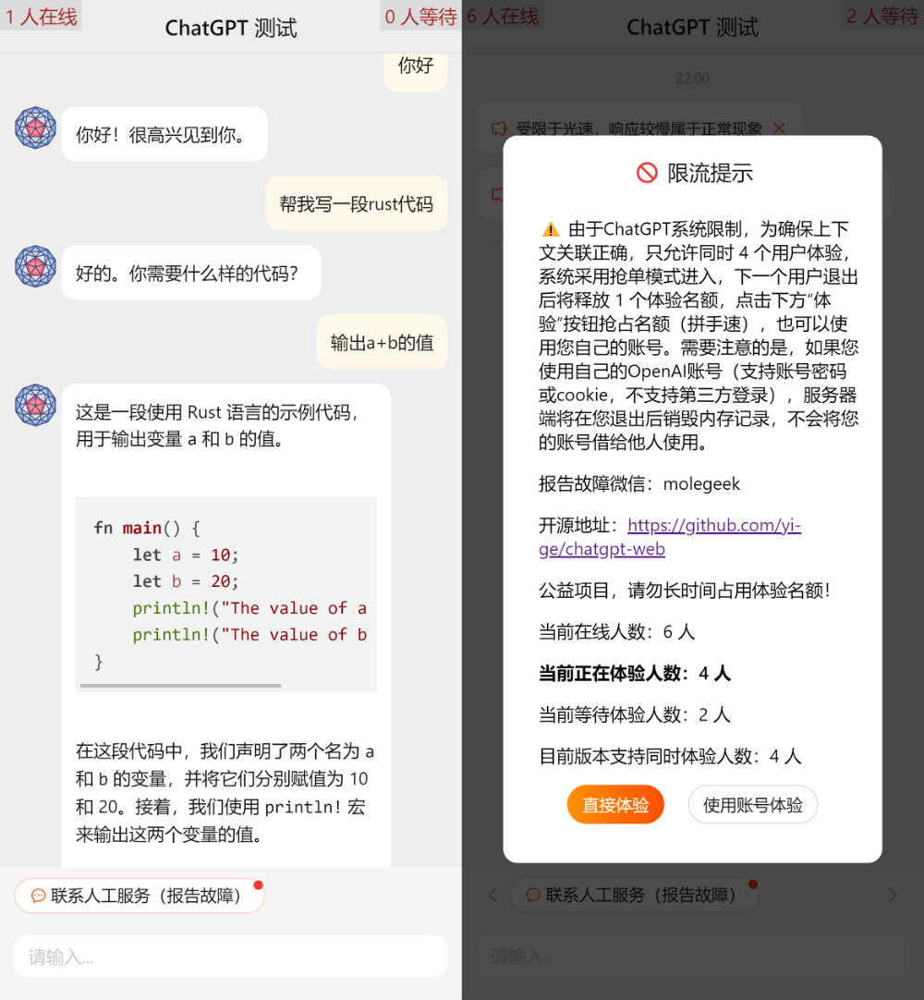

# ChatGPT Web

Multi-user h5 version, 3rd party ChatGPT web page. Uses OpenAPI official web API.

第三方ChatGPT H5客户端，借助OpenAPI官方web的API实现。

**在线体验地址：** 【已下线】

Back-end repository（后端代码仓库）: <https://github.com/yi-ge/chatgpt-api>

本项目旨在降低中国大陆用户体验ChatGPT的成本。

**⚠⚠⚠由于OpenAPI于(2022年12月12日)增加了Cloudflare防护，考虑合规性，同天此项目的在线系统已被作者关停且开源项目不再更新。有体验需求的用户请访问OpenAI官网，敬请理解。请勿将本系统代码用于商业用途！**

**仿冒或冒用ChatGPT、OpenAI名义开展经营活动，可能构成《商标法》、《反不正当竞争法》下的一系列侵权行为；
以之牟利造成消费者损失的，可能产生《商标法》、《反不正当竞争法》、《消费者权益保护法》下的民事或行政责任，情节严重并造成重大损失的，还有可能构成刑事犯罪；
如果提供这种跨境经营服务存在私自搭建国际信道的情形，还有可能违反《网络安全法》、《刑法》的相关规定，承担行政责任或构成刑事犯罪。**

## Feature

- 部署后可实现在中国大陆访问进行ChatGPT体验
- 支持多账号、多用户
- 支持代码显示
- 支持关联上下文
- 足够简单，易于修改（前端代码200行，后端代码130行）

## Preview



## 开发

参照`.env.example`，新建`.env.development`文件，配置好环境变量。

```bash
yarn start
```

## 部署

参照`.env.example`，新建`.env`文件，配置好环境变量。

```bash
yarn build
```

`build`文件夹中即为编译后的静态资源文件。

**⚠⚠⚠请勿用于商业用途，请保留开源仓库地址链接，请自觉遵守约定。**

**⚠⚠⚠由于OpenAPI于(2022年12月12日)增加了Cloudflare防护，考虑合规性，同天此项目的在线系统已被作者关停且开源项目不再更新。有体验需求的用户请访问OpenAI官网，敬请理解。请勿将本系统代码用于商业用途！**

## Disclaimers 免责声明

This is not an official OpenAI product. This is a personal project and is not affiliated with OpenAI in any way. Don't sue me.
这不是官方的 OpenAI 产品。这是一个个人项目，与 OpenAI 没有任何关系。别告我。

The code is for demo and testing only.
代码仅用于演示和测试。
